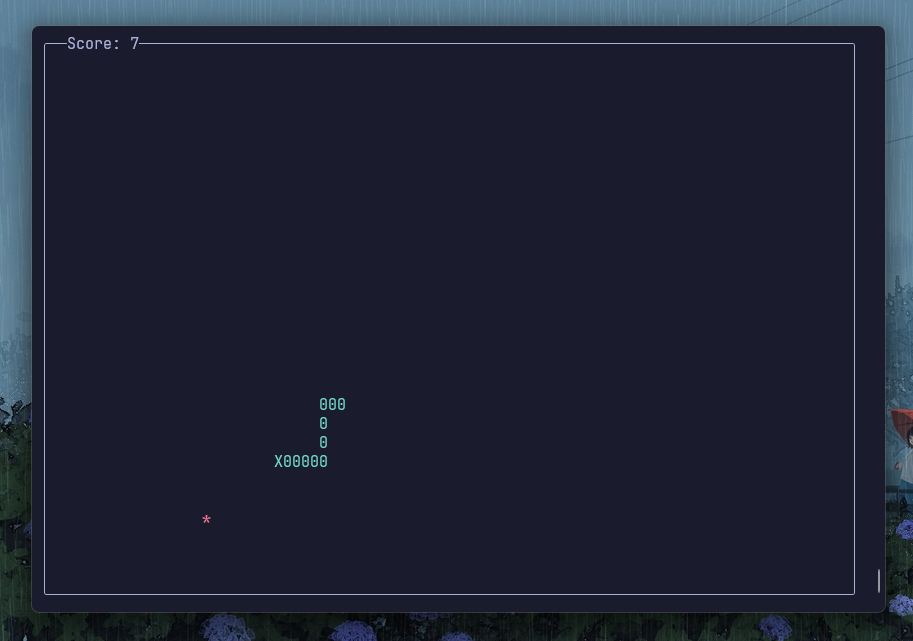

# Snakey 🐍

This is a snake game in the terminal, written in python.

### Controls:

- WASD to control the snake
- q to quit game

### Requirements

- Python
- Modern terminal that supports unicode

### Installing and running

2.  Clone this repository.
3.  Run `python3 main.py` to run the game. (No package installation required)
